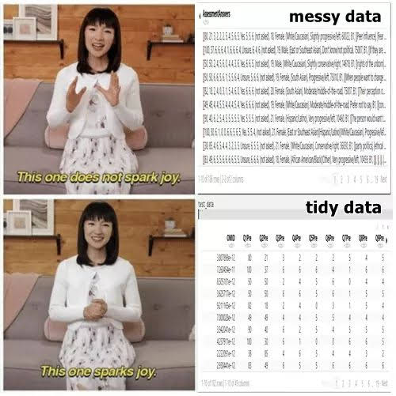
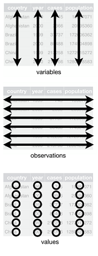

```{r setup, include=FALSE}
options(htmltools.dir.version = FALSE)

library(kableExtra)
library(tidyverse)

mytable <- function(df){
  kable(df) %>%
  kable_styling(bootstrap_options = c("hover", "condensed", "responsive"),
                full_width = F,
                font_size = 14)}

survey <-
  tibble(
    student = rep(c(1:3),3),
    food = c(rep("fruit",3),rep("vegetable",3), rep("icecream",3)),
    rate = abs(round(rnorm(9, mean = 4, sd = 3), 0))) %>% 
  arrange(student)
```


```{r xaringan-themer, include=FALSE}
library(xaringanthemer)
mono_accent(
  base_color = "#011A5E", 
  table_row_even_background_color = "#FFFFFF",
  header_font_google = google_font("Lora", "500"),
  text_font_google   = google_font("Lato", "400", "400i")
)
```

name: title
class: center, middle

#Tidy data#

L. Paloma Rojas Saunero


---

class: center, middle


---

class: center, middle


---

## The rules of Tidy data:

.pull-left[

- **Rule 1**: Each **_variable_** must have its own **_column_**.
<br><br><br><br><br><br>
- **Rule 2**: Each **_observation_** must have its own **_row_**.
<br><br><br><br><br><br>
- **Rule 3**: Each **_value_** must have its own **_cell_**.
]

.pull-right[

<center>

<center>
]
.foot-note[https://r4ds.had.co.nz/]
---
### Quiz 1

Which of these tables meets the 3 rules of tidy data?

.pull-left[
**Table A**
```{r, echo = FALSE}
table4a %>% 
mytable()
```

**Table B**
```{r, echo = FALSE}
table3 %>% 
mytable()
```

]

.pull-right[
**Table C**

```{r, echo = FALSE}
table1 %>% 
  select(- population) %>% mytable() 
```

]
---
## Reshape

```{r, message= FALSE, warning = FALSE}
library(tidyr)
```

.pull-left[

]

.pull-right[

**From wide to long: _cols to rows_**
```{r, message= FALSE, eval=FALSE}
pivot_longer(
  cols,
  names_to = "name",
  values_to = "val")
```

**From long to wide: _rows to cols_**
```{r, message= FALSE, eval = FALSE}
pivot_wider(
  names_from = name,
  values_from = val)
```
]

.foot-note[https://www.garrickadenbuie.com/project/tidyexplain/]
---
### Quiz

We need to transform Table 1, to look as Table 2. Fill in the blanks, correct if necessary:
```{r, eval = FALSE, error=TRUE}
survey %>% 
  pivot_____(names_from = "____",
              values_from = "____")
```

.pull-left[
**Table 1**
```{r, echo = FALSE}
survey %>% 
  mytable()
```
]
.pull-right[
**Table 2**
```{r, echo = FALSE}
survey %>%
  pivot_wider(names_from = food,
                values_from = rate) %>% mytable
```
]
