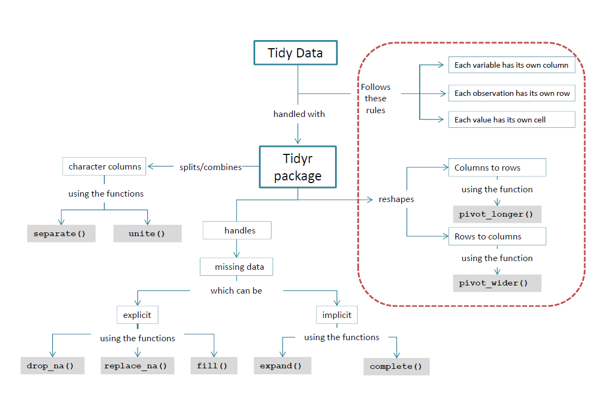

## Learner persona

**Kelly Katz**

- **_General background_**: Kelly is a medical student, she decided to go for a Master in Clinical Research before going back to the hospital for her clinical rotations. She is very young and enthusiastic. Although she studied some statistics during high school, this is the first time that she is learning how statistics are applied in health sciences and that motivates her. 

- **_Relevant experience_**: During her Master Program she learned how to do descriptive statistics and some basic analysis with SPSS, and she feels comfortable with it. She used R and Rstudio thanks to some specific biostats courses, but as she claims, it was "only copy-paste-enter pieces of code and interpret the output". So far, she did a bit of data wrangling in excel, most of her classes had already clean data ready for analysis. 

- **_Perceived needs_**: Kelly has one year to present her thesis, and she will work with observational data of individuals followed over time. She will have to merge and clean all the data files that she requires for her analysis and she is a bit anxious about it. She heard about the reproducibility crisis in research during some seminars, and she feels that the best way to make her data cleaning process transparent is do it in R.

- **_Special considerations_**: Kelly gets super enthusiastic about learning, but she is used to learn from books and a clearly specified curricula. The amount of information available online to learn R overwhelms her and doesn't let her focus, and that frustrates her. 

- **_Needs_**: Kelly needs a clear structure and guide to learn R. A step-by-step tutorial on each topic from the The R4DS book will help her learn the basics for data wrangling and plotting.

## Concept map

The class will introduce the rules of tidy data and the key functions to reshape data from wide to long and viceversa. The remaining concepts in the map will be taught in a following module of the extended class. The `dplyr` package has been studied and used so far, and the students are familiarized with the pipe `%>%`.



## Formative assessments

### 1. Which of these tables meets the 3 rules of tidy data?{.tabset}

#### Exercise

<div class = "row">
<div class = "col-md-6">

**Table A**
<table class="table table-hover table-condensed table-responsive" style="font-size: 14px; width: auto !important; margin-left: auto; margin-right: auto;">
 <thead>
  <tr>
   <th style="text-align:left;"> country </th>
   <th style="text-align:right;"> 1999 </th>
   <th style="text-align:right;"> 2000 </th>
  </tr>
 </thead>
<tbody>
  <tr>
   <td style="text-align:left;"> Afghanistan </td>
   <td style="text-align:right;"> 745 </td>
   <td style="text-align:right;"> 2666 </td>
  </tr>
  <tr>
   <td style="text-align:left;"> Brazil </td>
   <td style="text-align:right;"> 37737 </td>
   <td style="text-align:right;"> 80488 </td>
  </tr>
  <tr>
   <td style="text-align:left;"> China </td>
   <td style="text-align:right;"> 212258 </td>
   <td style="text-align:right;"> 213766 </td>
  </tr>
</tbody>
</table>

**Table B**
<table class="table table-hover table-condensed table-responsive" style="font-size: 14px; width: auto !important; margin-left: auto; margin-right: auto;">
 <thead>
  <tr>
   <th style="text-align:left;"> country </th>
   <th style="text-align:right;"> year </th>
   <th style="text-align:left;"> rate </th>
  </tr>
 </thead>
<tbody>
  <tr>
   <td style="text-align:left;"> Afghanistan </td>
   <td style="text-align:right;"> 1999 </td>
   <td style="text-align:left;"> 745/19987071 </td>
  </tr>
  <tr>
   <td style="text-align:left;"> Afghanistan </td>
   <td style="text-align:right;"> 2000 </td>
   <td style="text-align:left;"> 2666/20595360 </td>
  </tr>
  <tr>
   <td style="text-align:left;"> Brazil </td>
   <td style="text-align:right;"> 1999 </td>
   <td style="text-align:left;"> 37737/172006362 </td>
  </tr>
  <tr>
   <td style="text-align:left;"> Brazil </td>
   <td style="text-align:right;"> 2000 </td>
   <td style="text-align:left;"> 80488/174504898 </td>
  </tr>
  <tr>
   <td style="text-align:left;"> China </td>
   <td style="text-align:right;"> 1999 </td>
   <td style="text-align:left;"> 212258/1272915272 </td>
  </tr>
  <tr>
   <td style="text-align:left;"> China </td>
   <td style="text-align:right;"> 2000 </td>
   <td style="text-align:left;"> 213766/1280428583 </td>
  </tr>
</tbody>
</table>

</div>

<div class = "col-md-6">

**Table C**
<table class="table table-hover table-condensed table-responsive" style="font-size: 14px; width: auto !important; margin-left: auto; margin-right: auto;">
 <thead>
  <tr>
   <th style="text-align:left;"> country </th>
   <th style="text-align:right;"> year </th>
   <th style="text-align:right;"> cases </th>
  </tr>
 </thead>
<tbody>
  <tr>
   <td style="text-align:left;"> Afghanistan </td>
   <td style="text-align:right;"> 1999 </td>
   <td style="text-align:right;"> 745 </td>
  </tr>
  <tr>
   <td style="text-align:left;"> Afghanistan </td>
   <td style="text-align:right;"> 2000 </td>
   <td style="text-align:right;"> 2666 </td>
  </tr>
  <tr>
   <td style="text-align:left;"> Brazil </td>
   <td style="text-align:right;"> 1999 </td>
   <td style="text-align:right;"> 37737 </td>
  </tr>
  <tr>
   <td style="text-align:left;"> Brazil </td>
   <td style="text-align:right;"> 2000 </td>
   <td style="text-align:right;"> 80488 </td>
  </tr>
  <tr>
   <td style="text-align:left;"> China </td>
   <td style="text-align:right;"> 1999 </td>
   <td style="text-align:right;"> 212258 </td>
  </tr>
  <tr>
   <td style="text-align:left;"> China </td>
   <td style="text-align:right;"> 2000 </td>
   <td style="text-align:right;"> 213766 </td>
  </tr>
</tbody>
</table>

</div>
</div>

#### Solution

Correct answer is **Table C**

**_Missconceptions:_**

- It is frequent to find datasets with repeated measurements over time as in table A, students might have seen and used this type of datasets before and believe that each year represents a new variable, a new property to be measured.

- Although `rate` has values that reflect the state of the variable, it is a variable that is not tidy because it contains two numeric values that represent two different variables: `cases` and `population`. With those variables, it would be tidier to calculate the `rate` using `mutate`, and obtain a numeric value that can be summarised and plotted.

### 2. We need to transform table 1, to look as table 2. {.tabset}

#### Exercise
We need to transform Table 1, to look as Table 2. Fill in the blanks, correct if necessary:

```r
survey %>% 
  pivot_____(names_from = "____",
              values_from = "____")
```


<div class = "row">
<div class = "col-md-6">

**Table 1**
<table class="table table-hover table-condensed table-responsive" style="font-size: 14px; width: auto !important; margin-left: auto; margin-right: auto;">
 <thead>
  <tr>
   <th style="text-align:right;"> student </th>
   <th style="text-align:left;"> food </th>
   <th style="text-align:right;"> rate </th>
  </tr>
 </thead>
<tbody>
  <tr>
   <td style="text-align:right;"> 1 </td>
   <td style="text-align:left;"> fruit </td>
   <td style="text-align:right;"> 5 </td>
  </tr>
  <tr>
   <td style="text-align:right;"> 1 </td>
   <td style="text-align:left;"> vegetable </td>
   <td style="text-align:right;"> 1 </td>
  </tr>
  <tr>
   <td style="text-align:right;"> 1 </td>
   <td style="text-align:left;"> icecream </td>
   <td style="text-align:right;"> 7 </td>
  </tr>
  <tr>
   <td style="text-align:right;"> 2 </td>
   <td style="text-align:left;"> fruit </td>
   <td style="text-align:right;"> 5 </td>
  </tr>
  <tr>
   <td style="text-align:right;"> 2 </td>
   <td style="text-align:left;"> vegetable </td>
   <td style="text-align:right;"> 4 </td>
  </tr>
  <tr>
   <td style="text-align:right;"> 2 </td>
   <td style="text-align:left;"> icecream </td>
   <td style="text-align:right;"> 3 </td>
  </tr>
  <tr>
   <td style="text-align:right;"> 3 </td>
   <td style="text-align:left;"> fruit </td>
   <td style="text-align:right;"> 1 </td>
  </tr>
  <tr>
   <td style="text-align:right;"> 3 </td>
   <td style="text-align:left;"> vegetable </td>
   <td style="text-align:right;"> 6 </td>
  </tr>
  <tr>
   <td style="text-align:right;"> 3 </td>
   <td style="text-align:left;"> icecream </td>
   <td style="text-align:right;"> 9 </td>
  </tr>
</tbody>
</table>
</div>

<div class = "col-md-6">

**Table 2**

<table class="table table-hover table-condensed table-responsive" style="font-size: 14px; width: auto !important; margin-left: auto; margin-right: auto;">
 <thead>
  <tr>
   <th style="text-align:right;"> student </th>
   <th style="text-align:right;"> fruit </th>
   <th style="text-align:right;"> vegetable </th>
   <th style="text-align:right;"> icecream </th>
  </tr>
 </thead>
<tbody>
  <tr>
   <td style="text-align:right;"> 1 </td>
   <td style="text-align:right;"> 5 </td>
   <td style="text-align:right;"> 1 </td>
   <td style="text-align:right;"> 7 </td>
  </tr>
  <tr>
   <td style="text-align:right;"> 2 </td>
   <td style="text-align:right;"> 5 </td>
   <td style="text-align:right;"> 4 </td>
   <td style="text-align:right;"> 3 </td>
  </tr>
  <tr>
   <td style="text-align:right;"> 3 </td>
   <td style="text-align:right;"> 1 </td>
   <td style="text-align:right;"> 6 </td>
   <td style="text-align:right;"> 9 </td>
  </tr>
</tbody>
</table>

</div>
</div>

#### Solution


```r
survey %>%
  pivot_wider(names_from = food,
              values_from = rate) %>% 
  mytable()
```

<table class="table table-hover table-condensed table-responsive" style="font-size: 14px; width: auto !important; margin-left: auto; margin-right: auto;">
 <thead>
  <tr>
   <th style="text-align:right;"> student </th>
   <th style="text-align:right;"> fruit </th>
   <th style="text-align:right;"> vegetable </th>
   <th style="text-align:right;"> icecream </th>
  </tr>
 </thead>
<tbody>
  <tr>
   <td style="text-align:right;"> 1 </td>
   <td style="text-align:right;"> 5 </td>
   <td style="text-align:right;"> 1 </td>
   <td style="text-align:right;"> 7 </td>
  </tr>
  <tr>
   <td style="text-align:right;"> 2 </td>
   <td style="text-align:right;"> 5 </td>
   <td style="text-align:right;"> 4 </td>
   <td style="text-align:right;"> 3 </td>
  </tr>
  <tr>
   <td style="text-align:right;"> 3 </td>
   <td style="text-align:right;"> 1 </td>
   <td style="text-align:right;"> 6 </td>
   <td style="text-align:right;"> 9 </td>
  </tr>
</tbody>
</table>


## Materials

- [Class slides](https://palolili23.github.io/texam/index.html)

- [Class script](https://palolili23.github.io/texam/tidyr.html)
